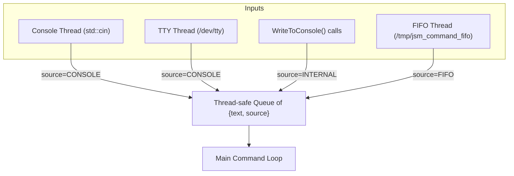

# JoyShockMapper Linux FIFO Command Isolation Plan

## Objective

Enable JoyShockMapper on Linux to accept commands via a named FIFO (`/tmp/jsm_command_fifo`), **while isolating these commands from console and internal commands** during processing. This allows differentiated handling, prioritization, or logging of commands based on their origin.

---

## Design Requirements

- **Create and listen on a named FIFO** at `/tmp/jsm_command_fifo`.
- **Do not interfere** with existing console input or `WriteToConsole()` commands.
- **Isolate FIFO commands** from console/internal commands during processing.
- **Ensure atomic, thread-safe command handling**.
- **Maintain responsiveness** for all input sources.

---

## High-Level Architecture

All command sources push tagged commands into a **single thread-safe queue**. The main command loop pops commands and branches logic based on the command's origin.

### Command Structure

```cpp
enum class CommandSource { CONSOLE, FIFO, INTERNAL };

struct Command {
    std::string text;
    CommandSource source;
};
```

### Architecture Diagram



---

## Implementation Plan

### 1. FIFO Setup

- At startup, check if `/tmp/jsm_command_fifo` exists.
- If not, create it with:

```cpp
mkfifo("/tmp/jsm_command_fifo", 0666);
```

### 2. Thread-Safe Command Queue

- Use a `std::queue<Command>` protected by a `std::mutex` and `std::condition_variable`.
- Alternatively, use a lock-free concurrent queue if preferred.

**Example:**

```cpp
#include <queue>
#include <mutex>
#include <condition_variable>

std::queue<Command> commandQueue;
std::mutex queueMutex;
std::condition_variable queueCV;
```

### 3. Input Threads

- **Console and TTY threads:**
  - On reading a line, push:

```cpp
{
    std::lock_guard<std::mutex> lock(queueMutex);
    commandQueue.push(Command{line, CommandSource::CONSOLE});
    queueCV.notify_one();
}
```

- **`WriteToConsole()` calls:**

```cpp
{
    std::lock_guard<std::mutex> lock(queueMutex);
    commandQueue.push(Command{command, CommandSource::INTERNAL});
    queueCV.notify_one();
}
```

- **FIFO thread:**
  - Open FIFO with:

```cpp
int fifo_fd = open("/tmp/jsm_command_fifo", O_RDONLY | O_NONBLOCK);
```

  - Loop:
    - Use `select()` or `poll()` to wait for data.
    - Read lines from FIFO.
    - For each line, push:

```cpp
{
    std::lock_guard<std::mutex> lock(queueMutex);
    commandQueue.push(Command{line, CommandSource::FIFO});
    queueCV.notify_one();
}
```

  - On EOF (all writers closed), close and reopen FIFO to continue listening.

### 4. Main Command Loop

- Wait on `queueCV`.
- When notified, pop commands from `commandQueue`.
- **Branch processing logic based on `command.source`:**

```cpp
switch(command.source) {
    case CommandSource::CONSOLE:
        // Handle console command
        break;
    case CommandSource::FIFO:
        // Handle FIFO command
        break;
    case CommandSource::INTERNAL:
        // Handle internal command
        break;
}
```

### 5. Thread Cleanup

- Ensure all threads exit cleanly on shutdown.
- Close FIFO file descriptors.

---

## Benefits

- **Isolated processing:** Differentiate FIFO, console, and internal commands.
- **Atomic and thread-safe:** Commands are queued and processed one at a time.
- **Extensible:** Easily add new command sources.
- **Minimal disruption:** Only input threads and main loop require updates.
- **Robust:** Handles FIFO disconnects gracefully.

---

## Summary

This design cleanly integrates FIFO command input into JoyShockMapper on Linux, while isolating it from other command sources. It preserves atomicity, responsiveness, and extensibility, enabling flexible command handling.